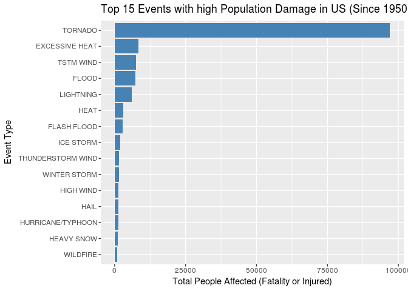
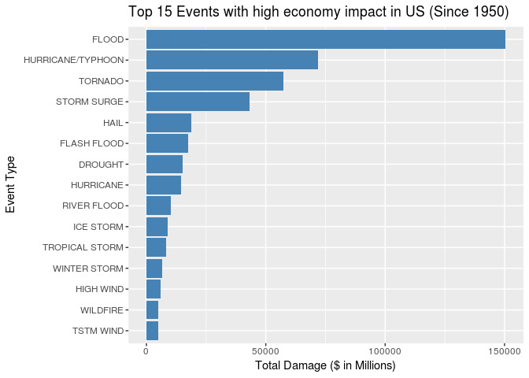

 

Synopsis:
---------

This project explores the U.S. National Oceanic and Atmospheric
Administration's (NOAA) storm database. The database tracks
characteristics of major storms and weather events in the United States,
including when and where they occur, as well as estimates of any
fatalities, injuries, and property damage.

This analysis explores the storm database to answer the following
questions:

1.  Across the United States, which types of events (as indicated in the
    EVTYPE variable) are most harmful with respect to population health?

2.  Across the United States, which types of events have the greatest
    economic consequences?

 

Data Processing:
----------------

**Data Source: **

The US NOAA Storm database can be downloaded from the following link.
The data is in the form of a comma-separated-value file compressed via
the bzip2 algorithm to reduce its size.

-   [Storm
    Data](https://d396qusza40orc.cloudfront.net/repdata%2Fdata%2FStormData.csv.bz2)
    \[47Mb\]

Some documentation of the database is available at followinh links.

-   National Weather Service [Storm Data
    Documentation](https://d396qusza40orc.cloudfront.net/repdata%2Fpeer2_doc%2Fpd01016005curr.pdf)

-   National Climatic Data Center Storm Events
    [FAQ](https://d396qusza40orc.cloudfront.net/repdata%2Fpeer2_doc%2FNCDC%20Storm%20Events-FAQ%20Page.pdf)

 

**Download the data: **

Download the input data file, load the dataset

    download.file("https://d396qusza40orc.cloudfront.net/repdata%2Fdata%2FStormData.csv.bz2",
                  "StormData.csv.bz2")

    input = read.csv(bzfile("StormData.csv.bz2"))

 

**Explore the data: **

Look at the data columns, class and levels

    str(input)

    ## 'data.frame':    902297 obs. of  37 variables:
    ##  $ STATE__   : num  1 1 1 1 1 1 1 1 1 1 ...
    ##  $ BGN_DATE  : Factor w/ 16335 levels "10/10/1954 0:00:00",..: 6523 6523 4213 11116 1426 1426 1462 2873 3980 3980 ...
    ##  $ BGN_TIME  : Factor w/ 3608 levels "000","0000","00:00:00 AM",..: 212 257 2645 1563 2524 3126 122 1563 3126 3126 ...
    ##  $ TIME_ZONE : Factor w/ 22 levels "ADT","AKS","AST",..: 7 7 7 7 7 7 7 7 7 7 ...
    ##  $ COUNTY    : num  97 3 57 89 43 77 9 123 125 57 ...
    ##  $ COUNTYNAME: Factor w/ 29601 levels "","5NM E OF MACKINAC BRIDGE TO PRESQUE ISLE LT MI",..: 13513 1873 4598 10592 4372 10094 1973 23873 24418 4598 ...
    ##  $ STATE     : Factor w/ 72 levels "AK","AL","AM",..: 2 2 2 2 2 2 2 2 2 2 ...
    ##  $ EVTYPE    : Factor w/ 985 levels "?","ABNORMALLY DRY",..: 830 830 830 830 830 830 830 830 830 830 ...
    ##  $ BGN_RANGE : num  0 0 0 0 0 0 0 0 0 0 ...
    ##  $ BGN_AZI   : Factor w/ 35 levels "","E","Eas","EE",..: 1 1 1 1 1 1 1 1 1 1 ...
    ##  $ BGN_LOCATI: Factor w/ 54429 levels "","?","(01R)AFB GNRY RNG AL",..: 1 1 1 1 1 1 1 1 1 1 ...
    ##  $ END_DATE  : Factor w/ 6663 levels "","10/10/1993 0:00:00",..: 1 1 1 1 1 1 1 1 1 1 ...
    ##  $ END_TIME  : Factor w/ 3647 levels "","?","0000",..: 1 1 1 1 1 1 1 1 1 1 ...
    ##  $ COUNTY_END: num  0 0 0 0 0 0 0 0 0 0 ...
    ##  $ COUNTYENDN: logi  NA NA NA NA NA NA ...
    ##  $ END_RANGE : num  0 0 0 0 0 0 0 0 0 0 ...
    ##  $ END_AZI   : Factor w/ 24 levels "","E","ENE","ESE",..: 1 1 1 1 1 1 1 1 1 1 ...
    ##  $ END_LOCATI: Factor w/ 34506 levels "","(0E4)PAYSON ARPT",..: 1 1 1 1 1 1 1 1 1 1 ...
    ##  $ LENGTH    : num  14 2 0.1 0 0 1.5 1.5 0 3.3 2.3 ...
    ##  $ WIDTH     : num  100 150 123 100 150 177 33 33 100 100 ...
    ##  $ F         : int  3 2 2 2 2 2 2 1 3 3 ...
    ##  $ MAG       : num  0 0 0 0 0 0 0 0 0 0 ...
    ##  $ FATALITIES: num  0 0 0 0 0 0 0 0 1 0 ...
    ##  $ INJURIES  : num  15 0 2 2 2 6 1 0 14 0 ...
    ##  $ PROPDMG   : num  25 2.5 25 2.5 2.5 2.5 2.5 2.5 25 25 ...
    ##  $ PROPDMGEXP: Factor w/ 19 levels "","-","?","+",..: 17 17 17 17 17 17 17 17 17 17 ...
    ##  $ CROPDMG   : num  0 0 0 0 0 0 0 0 0 0 ...
    ##  $ CROPDMGEXP: Factor w/ 9 levels "","?","0","2",..: 1 1 1 1 1 1 1 1 1 1 ...
    ##  $ WFO       : Factor w/ 542 levels "","2","43","9V9",..: 1 1 1 1 1 1 1 1 1 1 ...
    ##  $ STATEOFFIC: Factor w/ 250 levels "","ALABAMA, Central",..: 1 1 1 1 1 1 1 1 1 1 ...
    ##  $ ZONENAMES : Factor w/ 25112 levels "","                                                                                                               "| __truncated__,..: 1 1 1 1 1 1 1 1 1 1 ...
    ##  $ LATITUDE  : num  3040 3042 3340 3458 3412 ...
    ##  $ LONGITUDE : num  8812 8755 8742 8626 8642 ...
    ##  $ LATITUDE_E: num  3051 0 0 0 0 ...
    ##  $ LONGITUDE_: num  8806 0 0 0 0 ...
    ##  $ REMARKS   : Factor w/ 436781 levels ""," ","  ","   ",..: 1 1 1 1 1 1 1 1 1 1 ...
    ##  $ REFNUM    : num  1 2 3 4 5 6 7 8 9 10 ...

By reading the dataset and database document, the following are the
required attributes to determine the most harmful event types to
population health and that has greatest economic consequences.

-   BGN\_DATE
-   EVTYPE
-   FATALITIES
-   INJURIES
-   PROPDMG
-   PROPDMGEXP
-   CROPDMG
-   CROPDMGEXP

Confine the dataset to above fields.

    # Load required package
    library(dplyr)
    library(lubridate)
    library(gridExtra)
    library(ggplot2)

    # Subset data and determine the "year" from event begin date
    stormdata = 
      input %>%
      select(BGN_DATE, EVTYPE, FATALITIES, INJURIES, PROPDMG, PROPDMGEXP, CROPDMG, CROPDMGEXP) %>%
      mutate(BGN_YEAR=year(mdy_hms(BGN_DATE)))

Look at the damage expressions or unit of measurement, to eliminate any
noisy data.

    # Property damage by damage expression i.e. unit of measurement
    stormdata %>%
      group_by(PROPDMGEXP) %>%
      summarise(sum(PROPDMG))

    ## # A tibble: 19 x 2
    ##    PROPDMGEXP `sum(PROPDMG)`
    ##        <fctr>          <dbl>
    ##  1                    527.41
    ##  2          -          15.00
    ##  3          ?           0.00
    ##  4          +         117.00
    ##  5          0        7108.30
    ##  6          1           0.00
    ##  7          2          12.00
    ##  8          3          20.00
    ##  9          4          14.50
    ## 10          5         210.50
    ## 11          6          65.00
    ## 12          7          82.00
    ## 13          8           0.00
    ## 14          B         275.85
    ## 15          h           2.00
    ## 16          H          25.00
    ## 17          K    10735292.10
    ## 18          m          38.90
    ## 19          M      140694.45

    # Crop damage by damage expression i.e. unit of measurement
    stormdata %>%
      group_by(CROPDMGEXP) %>%
      summarise(sum(CROPDMG))

    ## # A tibble: 9 x 2
    ##   CROPDMGEXP `sum(CROPDMG)`
    ##       <fctr>          <dbl>
    ## 1                     11.00
    ## 2          ?           0.00
    ## 3          0         260.00
    ## 4          2           0.00
    ## 5          B          13.61
    ## 6          k         436.00
    ## 7          K     1342955.91
    ## 8          m          10.00
    ## 9          M       34140.80

From the above data, it can be observe that there is different unit of
measurement. We can understand from the database document that,

-   k or K - stands for Thousands
-   m or M - stands for Millions
-   b or B - stands for Billions

We will treat all the other units as noisy data and will not consider
them for this analysis.

 

**Process the data: **

Determine the total FATALITIES and INJURIES by Event Type. Also, convert
the damage to single unit i.e. to Thousands and determine the total
PROPERTY and CROP damage by Event Type.

    processeddata =
      stormdata %>%
      
      # Derive the people impact and damage
      mutate(PeopleImpact = FATALITIES + INJURIES,
             Damage_K = case_when(toupper(PROPDMGEXP) == 'K' ~ PROPDMG,
                                   toupper(PROPDMGEXP) == 'M' ~ PROPDMG*10^3,
                                   toupper(PROPDMGEXP) == 'B' ~ PROPDMG*10^6,
                                   TRUE ~ 0.00) 
                        +
                        case_when(CROPDMGEXP == 'K' ~ CROPDMG,
                                   CROPDMGEXP == 'M' ~ CROPDMG*10^3,
                                   CROPDMGEXP == 'B' ~ CROPDMG*10^6,
                                   TRUE ~ 0.00) 
             ) %>%
      
      # Determine Total People Impact and Total Damage by Event Type
      group_by(EventType = EVTYPE) %>%
      summarise(TotalPeopleImpact = sum(PeopleImpact), TotalDamage_Millions = sum(Damage_K)/10^3) %>%
      
      # Rank the Events by People Impact and by Total Damage
      mutate(TotalPeopleImpact_Rank= row_number(desc(TotalPeopleImpact)),
             TotalDamage_Rank = row_number(desc(TotalDamage_Millions)))

Determine the top 15 events that has caused,

1.  High population impact
2.  High economic consequences

<!-- -->

    # Top 15 Events with high Population impact
    HighPeopleImpact = 
      processeddata %>%
      select(EventType, TotalPeopleImpact_Rank, TotalPeopleImpact) %>%
      filter(TotalPeopleImpact_Rank < 16) %>%
      
      # Re-arrange the event type levels to display the bars in descending order
      arrange(-TotalPeopleImpact_Rank) %>%
      mutate(EventType = factor(EventType, EventType)) %>%
      # For table output
      arrange(TotalPeopleImpact_Rank)

    # Top 15 Events with high Economy impact
    HighEconomyImpact = 
      processeddata %>%
      select(EventType, TotalDamage_Rank, TotalDamage_Millions) %>%
      filter(TotalDamage_Rank < 16) %>%
      
      # Re-arrange the event type levels to display the bars in descending order
      arrange(-TotalDamage_Rank) %>%
      mutate(EventType = factor(EventType, EventType)) %>%
      # For table output
      arrange(TotalDamage_Rank)

 

Results:
--------

**Population Impact**

Following are the top 15 events that has caused high population impact
since 1950.

    ggplot(HighPeopleImpact, aes(EventType, TotalPeopleImpact)) + 
      geom_bar(position="dodge", stat="identity", fill="steelblue") + 
      coord_flip() +
      labs(x="Event Type", 
           y="Total People Affected (Fatality or Injured)", 
           title = "Top 15 Events with high Population Damage in US (Since 1950)") 

    knitr::kable(HighPeopleImpact,format="pandoc")

<table>
<thead>
<tr class="header">
<th align="left">EventType</th>
<th align="right">TotalPeopleImpact_Rank</th>
<th align="right">TotalPeopleImpact</th>
</tr>
</thead>
<tbody>
<tr class="odd">
<td align="left">TORNADO</td>
<td align="right">1</td>
<td align="right">96979</td>
</tr>
<tr class="even">
<td align="left">EXCESSIVE HEAT</td>
<td align="right">2</td>
<td align="right">8428</td>
</tr>
<tr class="odd">
<td align="left">TSTM WIND</td>
<td align="right">3</td>
<td align="right">7461</td>
</tr>
<tr class="even">
<td align="left">FLOOD</td>
<td align="right">4</td>
<td align="right">7259</td>
</tr>
<tr class="odd">
<td align="left">LIGHTNING</td>
<td align="right">5</td>
<td align="right">6046</td>
</tr>
<tr class="even">
<td align="left">HEAT</td>
<td align="right">6</td>
<td align="right">3037</td>
</tr>
<tr class="odd">
<td align="left">FLASH FLOOD</td>
<td align="right">7</td>
<td align="right">2755</td>
</tr>
<tr class="even">
<td align="left">ICE STORM</td>
<td align="right">8</td>
<td align="right">2064</td>
</tr>
<tr class="odd">
<td align="left">THUNDERSTORM WIND</td>
<td align="right">9</td>
<td align="right">1621</td>
</tr>
<tr class="even">
<td align="left">WINTER STORM</td>
<td align="right">10</td>
<td align="right">1527</td>
</tr>
<tr class="odd">
<td align="left">HIGH WIND</td>
<td align="right">11</td>
<td align="right">1385</td>
</tr>
<tr class="even">
<td align="left">HAIL</td>
<td align="right">12</td>
<td align="right">1376</td>
</tr>
<tr class="odd">
<td align="left">HURRICANE/TYPHOON</td>
<td align="right">13</td>
<td align="right">1339</td>
</tr>
<tr class="even">
<td align="left">HEAVY SNOW</td>
<td align="right">14</td>
<td align="right">1148</td>
</tr>
<tr class="odd">
<td align="left">WILDFIRE</td>
<td align="right">15</td>
<td align="right">986</td>
</tr>
</tbody>
</table>

*Tornado* has caused high population damage in United States.

 

**Economic Impact**

Following are the top 15 events that has caused high economy impact
since 1950.

    ggplot(HighEconomyImpact, aes(EventType, TotalDamage_Millions)) + 
      geom_bar(position="dodge", stat="identity", fill="steelblue") + 
      coord_flip() +
      labs(x="Event Type", 
           y="Total Damage ($ in Millions)", 
           title = "Top 15 Events with high economy impact in US (Since 1950)") 

    knitr::kable(HighEconomyImpact,format="pandoc")

<table>
<thead>
<tr class="header">
<th align="left">EventType</th>
<th align="right">TotalDamage_Rank</th>
<th align="right">TotalDamage_Millions</th>
</tr>
</thead>
<tbody>
<tr class="odd">
<td align="left">FLOOD</td>
<td align="right">1</td>
<td align="right">150319.678</td>
</tr>
<tr class="even">
<td align="left">HURRICANE/TYPHOON</td>
<td align="right">2</td>
<td align="right">71913.713</td>
</tr>
<tr class="odd">
<td align="left">TORNADO</td>
<td align="right">3</td>
<td align="right">57352.114</td>
</tr>
<tr class="even">
<td align="left">STORM SURGE</td>
<td align="right">4</td>
<td align="right">43323.541</td>
</tr>
<tr class="odd">
<td align="left">HAIL</td>
<td align="right">5</td>
<td align="right">18757.804</td>
</tr>
<tr class="even">
<td align="left">FLASH FLOOD</td>
<td align="right">6</td>
<td align="right">17562.129</td>
</tr>
<tr class="odd">
<td align="left">DROUGHT</td>
<td align="right">7</td>
<td align="right">15018.672</td>
</tr>
<tr class="even">
<td align="left">HURRICANE</td>
<td align="right">8</td>
<td align="right">14610.229</td>
</tr>
<tr class="odd">
<td align="left">RIVER FLOOD</td>
<td align="right">9</td>
<td align="right">10148.405</td>
</tr>
<tr class="even">
<td align="left">ICE STORM</td>
<td align="right">10</td>
<td align="right">8967.041</td>
</tr>
<tr class="odd">
<td align="left">TROPICAL STORM</td>
<td align="right">11</td>
<td align="right">8382.237</td>
</tr>
<tr class="even">
<td align="left">WINTER STORM</td>
<td align="right">12</td>
<td align="right">6715.441</td>
</tr>
<tr class="odd">
<td align="left">HIGH WIND</td>
<td align="right">13</td>
<td align="right">5908.618</td>
</tr>
<tr class="even">
<td align="left">WILDFIRE</td>
<td align="right">14</td>
<td align="right">5060.587</td>
</tr>
<tr class="odd">
<td align="left">TSTM WIND</td>
<td align="right">15</td>
<td align="right">5038.936</td>
</tr>
</tbody>
</table>

*Flood* damage has caused high economy impact since 1950.
