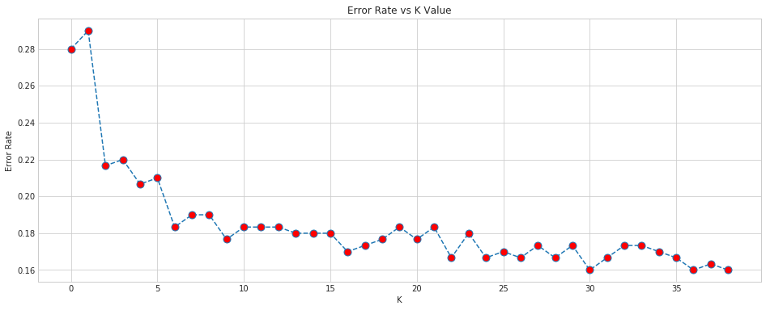

___

<a href='http://www.pieriandata.com'> </a>
___

# K Nearest Neighbors Project 

Welcome to the KNN Project! This will be a simple project very similar to the lecture, except you'll be given another data set. Go ahead and just follow the directions below.
## Import Libraries
**Import pandas,seaborn, and the usual libraries.**


```python
import numpy as np
import pandas as pd
```


```python
import matplotlib.pyplot as plt
import seaborn as sns
%matplotlib inline
```

## Get the Data
** Read the 'KNN_Project_Data csv file into a dataframe **


```python
df = pd.read_csv('KNN_Project_Data')
```

**Check the head of the dataframe.**


```python
df.head()
```


<div>
<style scoped>
    .dataframe tbody tr th:only-of-type {
        vertical-align: middle;
    }

    .dataframe tbody tr th {
        vertical-align: top;
    }

    .dataframe thead th {
        text-align: right;
    }
</style>
<table border="1" class="dataframe">
  <thead>
    <tr style="text-align: right;">
      <th></th>
      <th>XVPM</th>
      <th>GWYH</th>
      <th>TRAT</th>
      <th>TLLZ</th>
      <th>IGGA</th>
      <th>HYKR</th>
      <th>EDFS</th>
      <th>GUUB</th>
      <th>MGJM</th>
      <th>JHZC</th>
      <th>TARGET CLASS</th>
    </tr>
  </thead>
  <tbody>
    <tr>
      <th>0</th>
      <td>1636.670614</td>
      <td>817.988525</td>
      <td>2565.995189</td>
      <td>358.347163</td>
      <td>550.417491</td>
      <td>1618.870897</td>
      <td>2147.641254</td>
      <td>330.727893</td>
      <td>1494.878631</td>
      <td>845.136088</td>
      <td>0</td>
    </tr>
    <tr>
      <th>1</th>
      <td>1013.402760</td>
      <td>577.587332</td>
      <td>2644.141273</td>
      <td>280.428203</td>
      <td>1161.873391</td>
      <td>2084.107872</td>
      <td>853.404981</td>
      <td>447.157619</td>
      <td>1193.032521</td>
      <td>861.081809</td>
      <td>1</td>
    </tr>
    <tr>
      <th>2</th>
      <td>1300.035501</td>
      <td>820.518697</td>
      <td>2025.854469</td>
      <td>525.562292</td>
      <td>922.206261</td>
      <td>2552.355407</td>
      <td>818.676686</td>
      <td>845.491492</td>
      <td>1968.367513</td>
      <td>1647.186291</td>
      <td>1</td>
    </tr>
    <tr>
      <th>3</th>
      <td>1059.347542</td>
      <td>1066.866418</td>
      <td>612.000041</td>
      <td>480.827789</td>
      <td>419.467495</td>
      <td>685.666983</td>
      <td>852.867810</td>
      <td>341.664784</td>
      <td>1154.391368</td>
      <td>1450.935357</td>
      <td>0</td>
    </tr>
    <tr>
      <th>4</th>
      <td>1018.340526</td>
      <td>1313.679056</td>
      <td>950.622661</td>
      <td>724.742174</td>
      <td>843.065903</td>
      <td>1370.554164</td>
      <td>905.469453</td>
      <td>658.118202</td>
      <td>539.459350</td>
      <td>1899.850792</td>
      <td>0</td>
    </tr>
  </tbody>
</table>
</div>


```python
df.info()
```

    <class 'pandas.core.frame.DataFrame'>
    RangeIndex: 1000 entries, 0 to 999
    Data columns (total 11 columns):
    XVPM            1000 non-null float64
    GWYH            1000 non-null float64
    TRAT            1000 non-null float64
    TLLZ            1000 non-null float64
    IGGA            1000 non-null float64
    HYKR            1000 non-null float64
    EDFS            1000 non-null float64
    GUUB            1000 non-null float64
    MGJM            1000 non-null float64
    JHZC            1000 non-null float64
    TARGET CLASS    1000 non-null int64
    dtypes: float64(10), int64(1)
    memory usage: 86.0 KB


# EDA

Since this data is artificial, we'll just do a large pairplot with seaborn.

**Use seaborn on the dataframe to create a pairplot with the hue indicated by the TARGET CLASS column.**


```python
sns.set_style('whitegrid')
sns.pairplot(df,hue='TARGET CLASS',palette='deep')
```


    <seaborn.axisgrid.PairGrid at 0x7f16982780f0>


# Standardize the Variables

Time to standardize the variables.

** Import StandardScaler from Scikit learn.**


```python
from sklearn.preprocessing import StandardScaler
```

** Create a StandardScaler() object called scaler.**


```python
scalar = StandardScaler()
```

** Fit scaler to the features.**


```python
scalar.fit(df.drop('TARGET CLASS',axis=1))
```


    StandardScaler(copy=True, with_mean=True, with_std=True)


**Use the .transform() method to transform the features to a scaled version.**


```python
scalar_fe = scalar.transform(df.drop('TARGET CLASS',axis=1))
```

**Convert the scaled features to a dataframe and check the head of this dataframe to make sure the scaling worked.**


```python
df_fe = pd.DataFrame(scalar_fe,columns=df.columns[:-1])
df_fe.head()
```


<div>
<style scoped>
    .dataframe tbody tr th:only-of-type {
        vertical-align: middle;
    }

    .dataframe tbody tr th {
        vertical-align: top;
    }

    .dataframe thead th {
        text-align: right;
    }
</style>
<table border="1" class="dataframe">
  <thead>
    <tr style="text-align: right;">
      <th></th>
      <th>XVPM</th>
      <th>GWYH</th>
      <th>TRAT</th>
      <th>TLLZ</th>
      <th>IGGA</th>
      <th>HYKR</th>
      <th>EDFS</th>
      <th>GUUB</th>
      <th>MGJM</th>
      <th>JHZC</th>
    </tr>
  </thead>
  <tbody>
    <tr>
      <th>0</th>
      <td>1.568522</td>
      <td>-0.443435</td>
      <td>1.619808</td>
      <td>-0.958255</td>
      <td>-1.128481</td>
      <td>0.138336</td>
      <td>0.980493</td>
      <td>-0.932794</td>
      <td>1.008313</td>
      <td>-1.069627</td>
    </tr>
    <tr>
      <th>1</th>
      <td>-0.112376</td>
      <td>-1.056574</td>
      <td>1.741918</td>
      <td>-1.504220</td>
      <td>0.640009</td>
      <td>1.081552</td>
      <td>-1.182663</td>
      <td>-0.461864</td>
      <td>0.258321</td>
      <td>-1.041546</td>
    </tr>
    <tr>
      <th>2</th>
      <td>0.660647</td>
      <td>-0.436981</td>
      <td>0.775793</td>
      <td>0.213394</td>
      <td>-0.053171</td>
      <td>2.030872</td>
      <td>-1.240707</td>
      <td>1.149298</td>
      <td>2.184784</td>
      <td>0.342811</td>
    </tr>
    <tr>
      <th>3</th>
      <td>0.011533</td>
      <td>0.191324</td>
      <td>-1.433473</td>
      <td>-0.100053</td>
      <td>-1.507223</td>
      <td>-1.753632</td>
      <td>-1.183561</td>
      <td>-0.888557</td>
      <td>0.162310</td>
      <td>-0.002793</td>
    </tr>
    <tr>
      <th>4</th>
      <td>-0.099059</td>
      <td>0.820815</td>
      <td>-0.904346</td>
      <td>1.609015</td>
      <td>-0.282065</td>
      <td>-0.365099</td>
      <td>-1.095644</td>
      <td>0.391419</td>
      <td>-1.365603</td>
      <td>0.787762</td>
    </tr>
  </tbody>
</table>
</div>


# Train Test Split

**Use train_test_split to split your data into a training set and a testing set.**


```python
from sklearn.model_selection import train_test_split
```


```python
X=df_fe
y=df['TARGET CLASS']
X_train, X_test, y_train, y_test = train_test_split(
    X, y, test_size=0.3, random_state=101)
```

# Using KNN

**Import KNeighborsClassifier from scikit learn.**


```python
from sklearn.neighbors import KNeighborsClassifier
```

**Create a KNN model instance with n_neighbors=1**


```python
knn = KNeighborsClassifier(n_neighbors=1)
```

**Fit this KNN model to the training data.**


```python
knn.fit(X_train,y_train)
```


    KNeighborsClassifier(algorithm='auto', leaf_size=30, metric='minkowski',
               metric_params=None, n_jobs=1, n_neighbors=1, p=2,
               weights='uniform')


# Predictions and Evaluations
Let's evaluate our KNN model!

**Use the predict method to predict values using your KNN model and X_test.**


```python
pred = knn.predict(X_test)
```

** Create a confusion matrix and classification report.**


```python
from sklearn.metrics import confusion_matrix,classification_report
```


```python
print(confusion_matrix(y_test,pred))
```

    [[109  43]
     [ 41 107]]


```python
print(classification_report(y_test,pred))
```

                 precision    recall  f1-score   support
    
              0       0.73      0.72      0.72       152
              1       0.71      0.72      0.72       148
    
    avg / total       0.72      0.72      0.72       300
    


# Choosing a K Value
Let's go ahead and use the elbow method to pick a good K Value!

** Create a for loop that trains various KNN models with different k values, then keep track of the error_rate for each of these models with a list. Refer to the lecture if you are confused on this step.**


```python
errate = []
for i in range(1,40):
    knn = KNeighborsClassifier(n_neighbors=i)
    knn.fit(X_train,y_train)
    predi=knn.predict(X_test)
    errate.append(np.mean(predi != y_test))

```

**Now create the following plot using the information from your for loop.**


```python
plt.figure(figsize=(16,6))
plt.plot(errate,marker='o',markerfacecolor='red',markersize=9,
         linestyle='--')
plt.xlabel('K')
plt.ylabel('Error Rate')
plt.title('Error Rate vs K Value')
```


    Text(0.5,1,'Error Rate vs K Value')





## Retrain with new K Value

**Retrain your model with the best K value (up to you to decide what you want) and re-do the classification report and the confusion matrix.**


```python
knn = KNeighborsClassifier(n_neighbors=30)
knn.fit(X_train,y_train)
pred30=knn.predict(X_test)
```


```python
print('WITH K=30 \n')
print(confusion_matrix(y_test,pred30),'\n')
print(classification_report(y_test,pred30))
```

    WITH K=30 
    
    [[124  28]
     [ 24 124]] 
    
                 precision    recall  f1-score   support
    
              0       0.84      0.82      0.83       152
              1       0.82      0.84      0.83       148
    
    avg / total       0.83      0.83      0.83       300
    


# Great Job!
