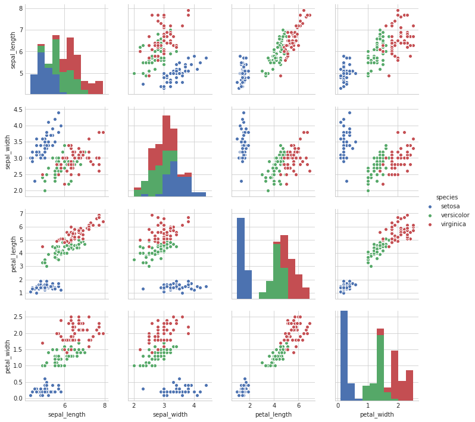
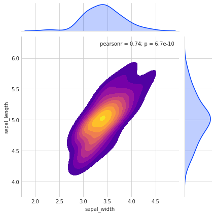

___

<a href='http://www.pieriandata.com'> </a>
___
# Support Vector Machines Project 

Welcome to your Support Vector Machine Project! Just follow along with the notebook and instructions below. We will be analyzing the famous iris data set!

## The Data
For this series of lectures, we will be using the famous [Iris flower data set](http://en.wikipedia.org/wiki/Iris_flower_data_set). 

The Iris flower data set or Fisher's Iris data set is a multivariate data set introduced by Sir Ronald Fisher in the 1936 as an example of discriminant analysis. 

The data set consists of 50 samples from each of three species of Iris (Iris setosa, Iris virginica and Iris versicolor), so 150 total samples. Four features were measured from each sample: the length and the width of the sepals and petals, in centimeters.

Here's a picture of the three different Iris types:


```python
# The Iris Setosa
from IPython.display import Image
url = 'http://upload.wikimedia.org/wikipedia/commons/5/56/Kosaciec_szczecinkowaty_Iris_setosa.jpg'
Image(url,width=300, height=300)
```


```python
# The Iris Versicolor
from IPython.display import Image
url = 'http://upload.wikimedia.org/wikipedia/commons/4/41/Iris_versicolor_3.jpg'
Image(url,width=300, height=300)
```


```python
# The Iris Virginica
from IPython.display import Image
url = 'http://upload.wikimedia.org/wikipedia/commons/9/9f/Iris_virginica.jpg'
Image(url,width=300, height=300)
```


The iris dataset contains measurements for 150 iris flowers from three different species.

The three classes in the Iris dataset:

    Iris-setosa (n=50)
    Iris-versicolor (n=50)
    Iris-virginica (n=50)

The four features of the Iris dataset:

    sepal length in cm
    sepal width in cm
    petal length in cm
    petal width in cm

## Get the data

**Use seaborn to get the iris data by using: iris = sns.load_dataset('iris') **


```python
import numpy as np
import pandas as pd
```


```python
import matplotlib.pyplot as plt
import seaborn as sns
%matplotlib inline
```


```python
iris = sns.load_dataset('iris')
```

Let's visualize the data and get you started!

## Exploratory Data Analysis

Time to put your data viz skills to the test! Try to recreate the following plots, make sure to import the libraries you'll need!

** Create a pairplot of the data set. Which flower species seems to be the most separable?**


```python
iris.head()
```


<div>
<style scoped>
    .dataframe tbody tr th:only-of-type {
        vertical-align: middle;
    }

    .dataframe tbody tr th {
        vertical-align: top;
    }

    .dataframe thead th {
        text-align: right;
    }
</style>
<table border="1" class="dataframe">
  <thead>
    <tr style="text-align: right;">
      <th></th>
      <th>sepal_length</th>
      <th>sepal_width</th>
      <th>petal_length</th>
      <th>petal_width</th>
      <th>species</th>
    </tr>
  </thead>
  <tbody>
    <tr>
      <th>0</th>
      <td>5.1</td>
      <td>3.5</td>
      <td>1.4</td>
      <td>0.2</td>
      <td>setosa</td>
    </tr>
    <tr>
      <th>1</th>
      <td>4.9</td>
      <td>3.0</td>
      <td>1.4</td>
      <td>0.2</td>
      <td>setosa</td>
    </tr>
    <tr>
      <th>2</th>
      <td>4.7</td>
      <td>3.2</td>
      <td>1.3</td>
      <td>0.2</td>
      <td>setosa</td>
    </tr>
    <tr>
      <th>3</th>
      <td>4.6</td>
      <td>3.1</td>
      <td>1.5</td>
      <td>0.2</td>
      <td>setosa</td>
    </tr>
    <tr>
      <th>4</th>
      <td>5.0</td>
      <td>3.6</td>
      <td>1.4</td>
      <td>0.2</td>
      <td>setosa</td>
    </tr>
  </tbody>
</table>
</div>


```python
sns.set_style('whitegrid')
sns.pairplot(data=iris,hue='species',palette='deep')
```


    <seaborn.axisgrid.PairGrid at 0x7fe648d32828>





**Create a kde plot of sepal_length versus sepal width for setosa species of flower.**


```python
sns.jointplot(data=iris[iris['species']=='setosa'],x='sepal_width',y='sepal_length',kind='kde',
             cmap='plasma', shade_lowest=False)
```


    <seaborn.axisgrid.JointGrid at 0x7fe641e100b8>





# Train Test Split

** Split your data into a training set and a testing set.**


```python
from sklearn.model_selection import train_test_split
```


```python
X=iris.drop('species',axis=1)
y=iris['species']
```


```python
X.shape
```


    (150, 4)


```python
y.shape
```


    (150,)


```python
X_train, X_test, y_train, y_test = train_test_split(
    X, y, test_size=0.3, random_state=101)
```


```python
X_train.shape
```


    (105, 4)


```python
X_test.shape
```


    (45, 4)


```python
y_train.shape
```


    (105,)


# Train a Model

Now its time to train a Support Vector Machine Classifier. 

**Call the SVC() model from sklearn and fit the model to the training data.**


```python
from sklearn.svm import SVC
```


```python
model = SVC()
```


```python
model.fit(X_train,y_train)
```


    SVC(C=1.0, cache_size=200, class_weight=None, coef0=0.0,
      decision_function_shape='ovr', degree=3, gamma='auto', kernel='rbf',
      max_iter=-1, probability=False, random_state=None, shrinking=True,
      tol=0.001, verbose=False)


## Model Evaluation

**Now get predictions from the model and create a confusion matrix and a classification report.**


```python
pred = model.predict(X_test)
```


```python
from sklearn.metrics import classification_report,confusion_matrix
```


```python
print(confusion_matrix(y_test,pred))
```

    [[13  0  0]
     [ 0 20  0]
     [ 0  0 12]]


```python
print(classification_report(y_test,pred))
```

                 precision    recall  f1-score   support
    
         setosa       1.00      1.00      1.00        13
     versicolor       1.00      1.00      1.00        20
      virginica       1.00      1.00      1.00        12
    
    avg / total       1.00      1.00      1.00        45
    


Wow! You should have noticed that your model was pretty good! Let's see if we can tune the parameters to try to get even better (unlikely, and you probably would be satisfied with these results in real like because the data set is quite small, but I just want you to practice using GridSearch.

## Gridsearch Practice

** Import GridsearchCV from SciKit Learn.**


```python
from sklearn.grid_search import GridSearchCV
```

**Create a dictionary called param_grid and fill out some parameters for C and gamma.**


```python
pgrid={'C':[.1,1,10,100],'gamma':[1,.1,.01,.001]}
```

** Create a GridSearchCV object and fit it to the training data.**


```python
gd = GridSearchCV(SVC(),pgrid,verbose=2)
gd.fit(X_train,y_train)
```

    Fitting 3 folds for each of 16 candidates, totalling 48 fits
    [CV] C=0.1, gamma=1 ..................................................
    [CV] ......................................... C=0.1, gamma=1 -   0.0s
    [CV] C=0.1, gamma=1 ..................................................
    [CV] ......................................... C=0.1, gamma=1 -   0.0s
    [CV] C=0.1, gamma=1 ..................................................
    [CV] ......................................... C=0.1, gamma=1 -   0.0s
    [CV] C=0.1, gamma=0.1 ................................................
    [CV] ....................................... C=0.1, gamma=0.1 -   0.0s
    [CV] C=0.1, gamma=0.1 ................................................
    [CV] ....................................... C=0.1, gamma=0.1 -   0.0s
    [CV] C=0.1, gamma=0.1 ................................................
    [CV] ....................................... C=0.1, gamma=0.1 -   0.0s
    [CV] C=0.1, gamma=0.01 ...............................................
    [CV] ...................................... C=0.1, gamma=0.01 -   0.0s
    [CV] C=0.1, gamma=0.01 ...............................................
    [CV] ...................................... C=0.1, gamma=0.01 -   0.0s
    [CV] C=0.1, gamma=0.01 ...............................................
    [CV] ...................................... C=0.1, gamma=0.01 -   0.0s
    [CV] C=0.1, gamma=0.001 ..............................................
    [CV] ..................................... C=0.1, gamma=0.001 -   0.0s
    [CV] C=0.1, gamma=0.001 ..............................................
    [CV] ..................................... C=0.1, gamma=0.001 -   0.0s
    [CV] C=0.1, gamma=0.001 ..............................................
    [CV] ..................................... C=0.1, gamma=0.001 -   0.0s
    [CV] C=1, gamma=1 ....................................................
    [CV] ........................................... C=1, gamma=1 -   0.0s
    [CV] C=1, gamma=1 ....................................................
    [CV] ........................................... C=1, gamma=1 -   0.0s
    [CV] C=1, gamma=1 ....................................................
    [CV] ........................................... C=1, gamma=1 -   0.0s
    [CV] C=1, gamma=0.1 ..................................................
    [CV] ......................................... C=1, gamma=0.1 -   0.0s
    [CV] C=1, gamma=0.1 ..................................................
    [CV] ......................................... C=1, gamma=0.1 -   0.0s
    [CV] C=1, gamma=0.1 ..................................................
    [CV] ......................................... C=1, gamma=0.1 -   0.0s
    [CV] C=1, gamma=0.01 .................................................
    [CV] ........................................ C=1, gamma=0.01 -   0.0s
    [CV] C=1, gamma=0.01 .................................................
    [CV] ........................................ C=1, gamma=0.01 -   0.0s
    [CV] C=1, gamma=0.01 .................................................
    [CV] ........................................ C=1, gamma=0.01 -   0.0s
    [CV] C=1, gamma=0.001 ................................................
    [CV] ....................................... C=1, gamma=0.001 -   0.0s
    [CV] C=1, gamma=0.001 ................................................
    [CV] ....................................... C=1, gamma=0.001 -   0.0s
    [CV] C=1, gamma=0.001 ................................................
    [CV] ....................................... C=1, gamma=0.001 -   0.0s
    [CV] C=10, gamma=1 ...................................................
    [CV] .......................................... C=10, gamma=1 -   0.0s
    [CV] C=10, gamma=1 ...................................................
    [CV] .......................................... C=10, gamma=1 -   0.0s
    [CV] C=10, gamma=1 ...................................................
    [CV] .......................................... C=10, gamma=1 -   0.0s
    [CV] C=10, gamma=0.1 .................................................
    [CV] ........................................ C=10, gamma=0.1 -   0.0s
    [CV] C=10, gamma=0.1 .................................................
    [CV] ........................................ C=10, gamma=0.1 -   0.0s
    [CV] C=10, gamma=0.1 .................................................
    [CV] ........................................ C=10, gamma=0.1 -   0.0s
    [CV] C=10, gamma=0.01 ................................................
    [CV] ....................................... C=10, gamma=0.01 -   0.0s
    [CV] C=10, gamma=0.01 ................................................
    [CV] ....................................... C=10, gamma=0.01 -   0.0s
    [CV] C=10, gamma=0.01 ................................................
    [CV] ....................................... C=10, gamma=0.01 -   0.0s
    [CV] C=10, gamma=0.001 ...............................................
    [CV] ...................................... C=10, gamma=0.001 -   0.0s
    [CV] C=10, gamma=0.001 ...............................................
    [CV] ...................................... C=10, gamma=0.001 -   0.0s
    [CV] C=10, gamma=0.001 ...............................................
    [CV] ...................................... C=10, gamma=0.001 -   0.0s
    [CV] C=100, gamma=1 ..................................................
    [CV] ......................................... C=100, gamma=1 -   0.0s
    [CV] C=100, gamma=1 ..................................................
    [CV] ......................................... C=100, gamma=1 -   0.0s
    [CV] C=100, gamma=1 ..................................................
    [CV] ......................................... C=100, gamma=1 -   0.0s
    [CV] C=100, gamma=0.1 ................................................
    [CV] ....................................... C=100, gamma=0.1 -   0.0s
    [CV] C=100, gamma=0.1 ................................................
    [CV] ....................................... C=100, gamma=0.1 -   0.0s
    [CV] C=100, gamma=0.1 ................................................
    [CV] ....................................... C=100, gamma=0.1 -   0.0s
    [CV] C=100, gamma=0.01 ...............................................
    [CV] ...................................... C=100, gamma=0.01 -   0.0s
    [CV] C=100, gamma=0.01 ...............................................
    [CV] ...................................... C=100, gamma=0.01 -   0.0s
    [CV] C=100, gamma=0.01 ...............................................
    [CV] ...................................... C=100, gamma=0.01 -   0.0s
    [CV] C=100, gamma=0.001 ..............................................
    [CV] ..................................... C=100, gamma=0.001 -   0.0s
    [CV] C=100, gamma=0.001 ..............................................
    [CV] ..................................... C=100, gamma=0.001 -   0.0s
    [CV] C=100, gamma=0.001 ..............................................
    [CV] ..................................... C=100, gamma=0.001 -   0.0s


    [Parallel(n_jobs=1)]: Done   1 out of   1 | elapsed:    0.0s remaining:    0.0s
    [Parallel(n_jobs=1)]: Done  48 out of  48 | elapsed:    0.1s finished


    GridSearchCV(cv=None, error_score='raise',
           estimator=SVC(C=1.0, cache_size=200, class_weight=None, coef0=0.0,
      decision_function_shape='ovr', degree=3, gamma='auto', kernel='rbf',
      max_iter=-1, probability=False, random_state=None, shrinking=True,
      tol=0.001, verbose=False),
           fit_params={}, iid=True, n_jobs=1,
           param_grid={'C': [0.1, 1, 10, 100], 'gamma': [1, 0.1, 0.01, 0.001]},
           pre_dispatch='2*n_jobs', refit=True, scoring=None, verbose=2)


```python
gd.best_params_
```


    {'C': 1, 'gamma': 0.1}


** Now take that grid model and create some predictions using the test set and create classification reports and confusion matrices for them. Were you able to improve?**


```python
gpred = gd.predict(X_test)
```


```python
print(confusion_matrix(y_test,gpred))
```

    [[13  0  0]
     [ 0 19  1]
     [ 0  0 12]]


```python
print(classification_report(y_test,gpred))
```

                 precision    recall  f1-score   support
    
         setosa       1.00      1.00      1.00        13
     versicolor       1.00      0.95      0.97        20
      virginica       0.92      1.00      0.96        12
    
    avg / total       0.98      0.98      0.98        45
    


You should have done about the same or exactly the same, this makes sense, there is basically just one point that is too noisey to grab, which makes sense, we don't want to have an overfit model that would be able to grab that.

## Great Job!
