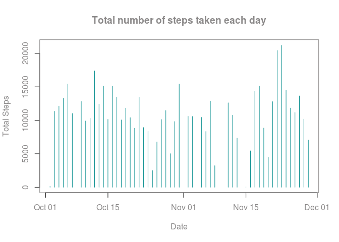
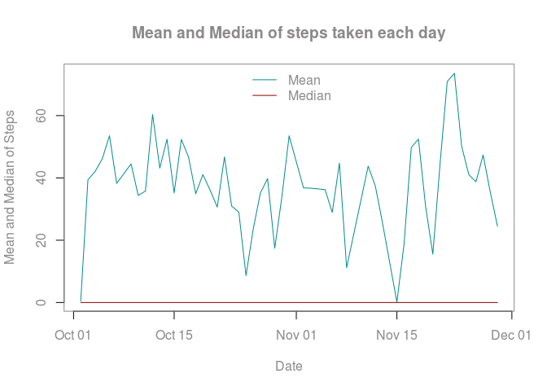
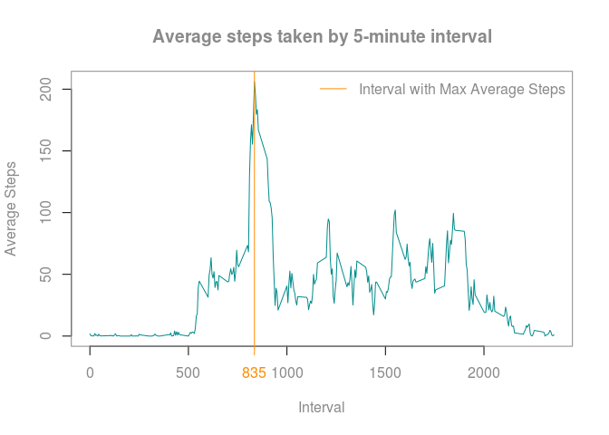
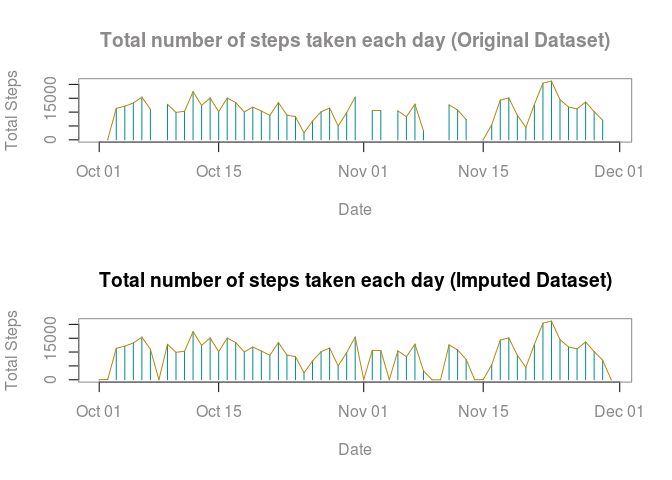
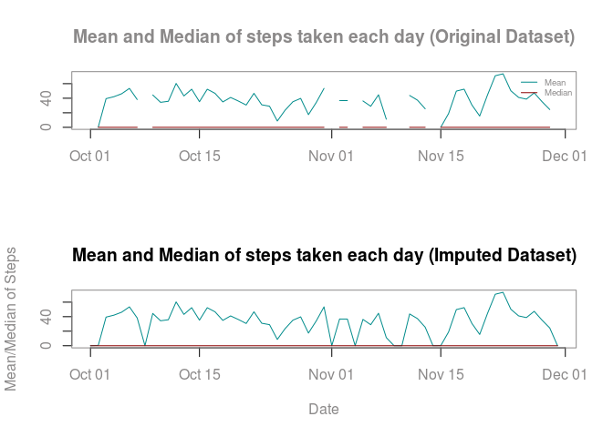
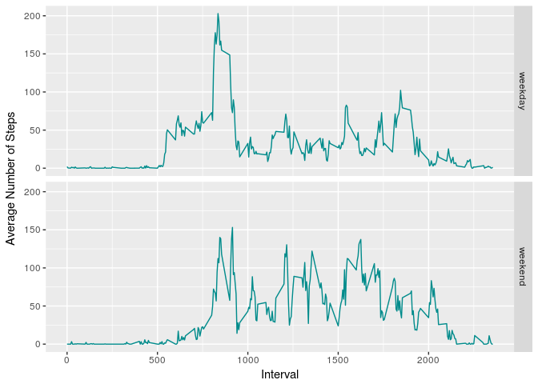

# Reproducible Research: Peer Assessment 1
November 11, 2017  

</br>  
  
### Loading and preprocessing the data 

Unzip the activity.zip file present in this reporsitory and load/process the data.


```r
# Load required packages
library(lubridate)
library(dplyr)
library(ggplot2)

# Unzip, check file size & load the data
unzip("activity.zip")
filesizeMB <- file.size("activity.csv")/2^20
activity <- read.csv("activity.csv")

# Check the attributes class & make necessary type conversations
str(activity)
activity$date <- ymd(activity$date)
```

</br>

### What is mean total number of steps taken per day?

A histogram of the total number of steps taken each day


```r
# Determine the total steps per day
stepsbyday <- na.omit(activity) %>% group_by(date) %>% summarise(TotalSteps = sum(steps))

# Plot the total steps per day
with(stepsbyday, 
     {
       par(col="snow4",col.lab="snow4", col.axis="snow4", col.main="snow4")
       plot(TotalSteps ~ date, 
            type = "h", 
            col = "darkcyan",
            xlab="Date", 
            ylab="Total Steps", 
            main = "Total number of steps taken each day")
    })
```

<!-- -->

Mean and median total number of steps taken per day


```r
# Determine the mean & median steps per day
stepsMeanMedian <- na.omit(activity) %>% group_by(date) %>% summarise(stepsMean = mean(steps), stepsMedian = median(steps))

# Display the records 
stepsMeanMedian
```

```
## # A tibble: 53 x 3
##          date stepsMean stepsMedian
##        <date>     <dbl>       <dbl>
##  1 2012-10-02   0.43750           0
##  2 2012-10-03  39.41667           0
##  3 2012-10-04  42.06944           0
##  4 2012-10-05  46.15972           0
##  5 2012-10-06  53.54167           0
##  6 2012-10-07  38.24653           0
##  7 2012-10-09  44.48264           0
##  8 2012-10-10  34.37500           0
##  9 2012-10-11  35.77778           0
## 10 2012-10-12  60.35417           0
## # ... with 43 more rows
```

```r
# Plot the mean & median steps per day
with(stepsMeanMedian, 
     {
       par(col="snow4",col.lab="snow4", col.axis="snow4", col.main="snow4")
       plot(stepsMean ~ date, 
            type = "l", 
            col="darkcyan",
            xlab="Date", 
            ylab="Mean and Median of Steps", 
            main = "Mean and Median of steps taken each day")
       
        lines(stepsMedian ~ date, 
            col="darkred")
       
        legend("top",legend = c("Mean","Median"), lty = 1, col = c("darkcyan","darkred"), bty = "n")
    })
```

<!-- -->

</br>

### What is the average daily activity pattern?

A time series plot of the 5-minute interval (x-axis) and the average number of steps taken, averaged across all days (y-axis)


```r
# Determine the average steps per interval, and the interval with Max average steps
avgStepsInterval <- na.omit(activity) %>% 
  group_by(interval) %>% 
  summarise(stepsMean = mean(steps))

maxStepsInterval <- subset(avgStepsInterval,stepsMean == max(stepsMean), select = interval)

# Plot the mean steps by interval
with(avgStepsInterval, 
     {
       par(col="snow4",col.lab="snow4", col.axis="snow4", col.main="snow4")
       plot(stepsMean ~ interval, 
            type = "l", 
            col="darkcyan",
            xlab="Interval", 
            ylab="Average Steps", 
            main = "Average steps taken by 5-minute interval")
       
       # Mark the interval with max average steps 
       abline(v=maxStepsInterval, col="darkorange")
       
       axis(side = 1,
            at = maxStepsInterval,
            labels = maxStepsInterval, 
            col = "darkorange", 
            col.axis ="darkorange")
       
       legend("topright",legend = c("Interval with Max Average Steps"), lty = 1, col = c("darkorange"), bty = "n")
    })
```

<!-- -->

<br/>

### Imputing missing values

Impute the missing values by replacing the NA's with Average steps for that day. If there is no steps taken in a day, then the Average steps will be 0 for that day.


```r
# Determine totals NA's in activity steps
summary(activity$steps)["NA's"]
```

```
## NA's 
## 2304
```

```r
# Replace NA's with 0 and Determine the average steps per day
meanStepsByDay <- activity %>%
  mutate(steps= if_else(is.na(steps),0,as.numeric(steps))) %>% 
  group_by(date) %>% 
  summarise(stepsMean = mean(steps))

# Imput NA's with average steps of the day, store it in the new dataset activity1
activity1 <- activity %>% 
  inner_join(meanStepsByDay, by=c("date"="date")) %>% 
  mutate(steps= if_else(is.na(steps),stepsMean,as.numeric(steps))) %>%
  select(steps,date,interval)
```

A histogram of the total number of steps taken each day between original vs imputed data set


```r
# Determine the total steps per day, for both original & imputed data set
stepsbyday <- activity %>% 
  group_by(date) %>% 
  summarise(TotalSteps = sum(steps))

stepsbyday1 <- activity1 %>% 
  group_by(date) %>% 
  summarise(TotalSteps = sum(steps))

# Plot the total steps per day
par(mfrow=c(2,1),
    col="snow4",
    col.lab="snow4", 
    col.axis="snow4", 
    col.main="snow4")

# Original data set
with(stepsbyday, 
     {
       plot(TotalSteps ~ date, 
            type = "h", 
            col = "darkcyan",
            xlab="Date", 
            ylab="Total Steps", 
            main = "Total number of steps taken each day (Original Dataset)")
       
       lines(TotalSteps ~ date, col="darkgoldenrod")
    })

# Imputed data set
with(stepsbyday1, 
     {
       plot(TotalSteps ~ date, 
            type = "h", 
            col = "darkcyan",
            xlab="Date", 
            ylab="Total Steps", 
            main = "Total number of steps taken each day (Imputed Dataset)",
            col.main="black")
       
       lines(TotalSteps ~ date, col="darkgoldenrod")
    })
```

<!-- -->

Mean and median total number of steps taken per day between Original vs Imputed data set


```r
# Determine the mean & median steps per day, for both original & imputed data set
stepsMeanMedian <- activity %>% 
  group_by(date) %>% 
  summarise(stepsMean = mean(steps), stepsMedian = median(steps))

stepsMeanMedian2 <- activity1 %>% 
  group_by(date) %>% 
  summarise(stepsMean = mean(steps), stepsMedian = median(steps))

# Plot the mean & median steps per day
par(mfrow=c(2,1),
    col="snow4",
    col.lab="snow4", 
    col.axis="snow4", 
    col.main="snow4")


# Original dataset
with(stepsMeanMedian, 
     {
       plot(stepsMean ~ date, 
            type = "l", 
            col="darkcyan",
            xlab="", 
            ylab="", 
            main = "Mean and Median of steps taken each day (Original Dataset)")
       
        lines(stepsMedian ~ date, 
            col="darkred")
       
        legend("topright",
               legend = c("Mean","Median"), 
               lty = 1, 
               col = c("darkcyan","darkred"), 
               cex = 0.6, 
               bty = "n")
    })

# Imputed dataset
with(stepsMeanMedian2, 
     {
       plot(stepsMean ~ date, 
            type = "l", 
            col="darkcyan",
            xlab="Date", 
            ylab="Mean/Median of Steps", 
            main = "Mean and Median of steps taken each day (Imputed Dataset)",
            col.main = "black"
            )
       
        lines(stepsMedian ~ date, 
            col="darkred")
       
    })
```

<!-- -->

From the above figures we can determine that imputed dataset has replaced NA's with mean value for the day. The dip in the lines denotes that there is no measurement of steps taken on the days that has NA's.

<br/>

### Are there differences in activity patterns between weekdays and weekends?

A time series plot (i.e. type = "l") of the 5-minute interval (x-axis) and the average number of steps taken, averaged across all weekday days or weekend days (y-axis)


```r
# Determine the average steps per interval & day type
avgStepsInterval <- activity1 %>% 
  mutate(daytype = if_else(weekdays(date) %in% c("Saturday","Sunday"), "weekend","weekday")) %>%
  group_by(interval, daytype) %>% 
  summarise(stepsMean = mean(steps))


# Plot the mean steps by interval
ggplot(avgStepsInterval, aes(interval, stepsMean)) + 
  geom_line(aes(colour=I("darkcyan"))) + 
  facet_grid(daytype~., switch = "x") +
  labs(x="Interval", y="Average Number of Steps") 
```

<!-- -->


